# AI Helpdesk Platform — Database ERD

Reflects `openapi.yml` after the B2B redesign: Requester replaces
Customer, Vendor added (invite-only), custom domain hosting and org
branding removed entirely, the ITIL-aligned ticket taxonomy (Department
→ Category → Subcategory, plus `TicketType`) added as a core feature,
and a platform-level super user (`PlatformUser` +
`PlatformAccessSession`) added as a deliberately separate identity
concept, not a tenant role.

```mermaid
erDiagram
    ORGANIZATION ||--o{ USER : "has many"
    ORGANIZATION ||--o{ INVITE : "has many"
    ORGANIZATION ||--o{ TICKET : "has many"
    ORGANIZATION ||--o{ ORGANIZATION_DOMAIN : "has many"
    ORGANIZATION ||--o{ NOTIFICATION : "has many"
    ORGANIZATION ||--o{ DEPARTMENT : "has many"
    ORGANIZATION ||--o{ PLATFORM_ACCESS_SESSION : "has many"

    PLATFORM_USER ||--o{ PLATFORM_ACCESS_SESSION : "opens"
    PLATFORM_ACCESS_SESSION ||--o{ TICKET_ACTIVITY : "attributed (optional)"

    USER ||--o{ TICKET : "createdBy"
    USER ||--o{ TICKET : "assignedTo (current, optional)"
    USER ||--o{ COMMENT : "authorUserId"
    USER ||--o{ INVITE : "invitedByUserId (optional)"
    USER ||--o{ TICKET_ACTIVITY : "actorUserId (optional)"
    USER ||--o{ TICKET_ASSIGNMENT : "assigneeUserId"
    USER ||--o{ TICKET_ASSIGNMENT : "assignedByUserId (optional)"
    USER ||--o{ NOTIFICATION : "recipient (userId)"

    DEPARTMENT ||--o{ CATEGORY : "has many"
    CATEGORY ||--o{ SUBCATEGORY : "has many"
    DEPARTMENT ||--o{ TICKET : "current departmentId (optional)"
    CATEGORY ||--o{ TICKET : "current categoryId (optional)"
    SUBCATEGORY ||--o{ TICKET : "current subcategoryId (optional)"
    DEPARTMENT ||--o{ TICKET_CLASSIFICATION : "referenced (optional)"
    CATEGORY ||--o{ TICKET_CLASSIFICATION : "referenced (optional)"
    SUBCATEGORY ||--o{ TICKET_CLASSIFICATION : "referenced (optional)"

    TICKET ||--o{ COMMENT : "has many"
    TICKET ||--o{ TICKET_ACTIVITY : "has many"
    TICKET ||--o{ TICKET_ASSIGNMENT : "has many"
    TICKET ||--o{ TICKET_SUMMARY : "has many (history)"
    TICKET ||--o{ TICKET_CLASSIFICATION : "has many (history)"
    TICKET ||--o| NOTIFICATION : "relatedTicketId (optional)"

    ORGANIZATION {
        uuid id PK
        text name
        text subdomain
        text supportEmail
        timestamp createdAt
        timestamp updatedAt
    }

    USER {
        uuid id PK
        uuid organizationId FK
        text identityProvider
        text externalId
        text name
        text email
        text role "nullable: OWNER, ADMIN, AGENT, REQUESTER, VENDOR"
        text status "ACTIVE, PENDING_APPROVAL, DEACTIVATED"
        timestamp createdAt
    }

    INVITE {
        uuid id PK
        uuid organizationId FK
        text email
        text role
        text status
        uuid invitedByUserId FK "nullable"
        timestamp expiresAt
        timestamp createdAt
        timestamp acceptedAt "nullable"
    }

    ORGANIZATION_DOMAIN {
        uuid id PK
        uuid organizationId FK
        text domain "globally unique across the platform, verified or not"
        boolean verified
        text verificationToken
        timestamp verifiedAt "nullable"
        timestamp createdAt
        timestamp updatedAt
    }

    DEPARTMENT {
        uuid id PK
        uuid organizationId FK
        text name
        boolean isActive
        timestamp createdAt
        timestamp updatedAt
    }

    CATEGORY {
        uuid id PK
        uuid departmentId FK
        text name
        boolean isActive
        timestamp createdAt
        timestamp updatedAt
    }

    SUBCATEGORY {
        uuid id PK
        uuid categoryId FK
        text name
        boolean isActive
        timestamp createdAt
        timestamp updatedAt
    }

    TICKET {
        uuid id PK
        uuid organizationId FK
        text title
        text description
        text status
        text priority
        text type "INCIDENT, SERVICE_REQUEST, PROBLEM, CHANGE"
        uuid departmentId FK "nullable, current value"
        uuid categoryId FK "nullable, current value"
        uuid subcategoryId FK "nullable, current value"
        text sentiment
        uuid createdById FK
        uuid assignedToId FK "nullable, current assignee"
        timestamp createdAt
        timestamp updatedAt
    }

    COMMENT {
        uuid id PK
        uuid ticketId FK
        uuid authorUserId FK
        text body
        boolean isInternalNote
        timestamp createdAt
    }

    TICKET_ACTIVITY {
        uuid id PK
        uuid ticketId FK
        uuid actorUserId FK "nullable, null if system-driven"
        uuid platformAccessSessionId FK "nullable, set if a PlatformUser made this change"
        text type "STATUS_CHANGED, PRIORITY_CHANGED, ASSIGNED, TYPE_CHANGED, DEPARTMENT_CHANGED, CATEGORY_CHANGED"
        text fromValue "nullable"
        text toValue
        jsonb metadata
        timestamp createdAt
    }

    TICKET_ASSIGNMENT {
        uuid id PK
        uuid ticketId FK
        uuid assigneeUserId FK "nullable, null represents an unassignment event"
        uuid assignedByUserId FK "nullable, null if automated"
        timestamp assignedAt
        text note "nullable"
    }

    TICKET_SUMMARY {
        uuid id PK
        uuid ticketId FK
        text summary
        text keyPoints "array, persisted alongside summary"
        text model
        timestamp createdAt
    }

    TICKET_CLASSIFICATION {
        uuid id PK
        uuid ticketId FK
        text type
        uuid departmentId FK "nullable"
        uuid categoryId FK "nullable"
        uuid subcategoryId FK "nullable"
        text priority
        text sentiment
        text source "AI or MANUAL"
        boolean shouldEscalate
        timestamp createdAt
    }

    NOTIFICATION {
        uuid id PK
        uuid userId FK
        uuid organizationId FK
        uuid relatedTicketId FK "nullable"
        text type
        text channel
        text status
        timestamp sentAt "nullable"
        timestamp createdAt
    }

    PLATFORM_USER {
        uuid id PK
        text identityProvider
        text externalId
        text email
        text name
        text role "PLATFORM_SUPPORT, PLATFORM_ADMIN"
        timestamp createdAt
    }

    PLATFORM_ACCESS_SESSION {
        uuid id PK
        uuid platformUserId FK
        uuid organizationId FK
        text reason
        timestamp startedAt
        timestamp endedAt "nullable, null while active"
    }
```

**Unassignment is representable, not just assignment.** Both
`Ticket.assignedToId` and `TicketAssignment.assigneeUserId` are
nullable — setting `assignedToId: null` via `PATCH /tickets/{ticketId}`
unassigns a ticket and writes a `TicketAssignment` row with
`assigneeUserId: null`, so "this ticket was unassigned, by whom, when"
has a real place in the history table rather than being an
unrepresentable state.

**`OrganizationDomain.domain` is globally unique, not just unique per
org.** This is what makes the bootstrap race condition safe: if two
people from a genuinely new company both hit the "no invite, no
subdomain, no domain match" bootstrap path within moments of each
other, the second auto-registration attempt hits this constraint
instead of silently creating a duplicate organization. Rather than
erroring, the second person is routed into the first person's
newly-created org as `PENDING_APPROVAL` — safe even though that org's
domain claim is itself still unverified, since `PENDING_APPROVAL`
grants no access on its own.

## Design notes

**`PlatformUser` has no `organizationId`, deliberately.** Every other
role in this schema is scoped to exactly one org, which is the
structural mechanism the entire tenant-isolation guarantee depends on.
A platform-level super user was specifically *not* added as another
`Role` value on `User` — that would either need a fake `organizationId`
or scattered "skip the org filter for this role" checks across every
endpoint, undermining the guarantee for one special case. Instead
`PlatformUser` is a genuinely separate table with no tenant
relationship at all, and `PlatformAccessSession` is the only bridge
between a platform user and any specific org's data: explicit, time-
boxed, reason-stated, and auditable, never a standing permission.

**Removed entirely (present in earlier drafts, cut during the B2B
pivot):** `OrganizationBranding`, and the `purposes`/`hostingStatus`/
`hostingActivatedAt` fields that used to live on `OrganizationDomain`.
This product is an internal service desk, not an external customer
portal — nothing needs to look like it belongs to the tenant's brand,
and nothing needs to be hosted on the tenant's own domain. See the
PRD's Section 7 for the full reasoning behind this cut.

**`Department` → `Category` → `Subcategory` are real tables, not a
generic `RefData` reference table.** This was a deliberate trade-off,
not a default: a single self-referencing reference-data table would
mean one CRUD implementation instead of three, and effortless
extensibility to new classification types. But the hierarchy here is
fixed and known at design time (always exactly this three-level shape,
per standard ITIL/service-desk taxonomy practice of capping category
depth at two levels beneath a department), so that extensibility
advantage doesn't apply. What real tables buy instead: Postgres itself
enforces "a Category's parent must be a Department," a constraint a
generic polymorphic table can't express without hand-written
application-level validation.

**`TicketType` stays a fixed global enum, while Department/Category/
Subcategory are org-scoped.** The distinction: `TicketType` carries
real behavior the app's logic depends on (SLA/workflow assumptions),
so every org shares the same fixed set. Department/Category/Subcategory
are just labels the app treats as opaque, and those genuinely vary
company to company, which is exactly the case where per-org
configurability earns its schema complexity.

**Current-value-plus-history, used twice.** `Ticket.assignedToId` holds
the current assignee for fast reads; `TicketAssignment` is the full
audit trail. `Ticket.departmentId/categoryId/subcategoryId` hold the
current classification for fast reads; `TicketClassification` is the
full history of how that classification was set, including whether AI
proposed it (`source: AI`) or a human overrode it (`source: MANUAL`).
Both pairs follow the same pattern deliberately.

**Vendor is in the role enum but has no distinct schema shape.** A
`User` with `role: VENDOR` is structurally identical to any other user
row — the restriction to "only tickets they're explicitly attached to"
is an application-layer permission rule (checked against
`TicketAssignment` or a future Vendor-ticket linking mechanism), not a
separate table. This keeps Vendor cheap to add later without a schema
change, consistent with it being explicitly low-priority/stretch scope.
